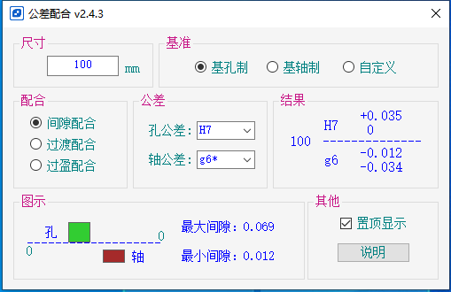
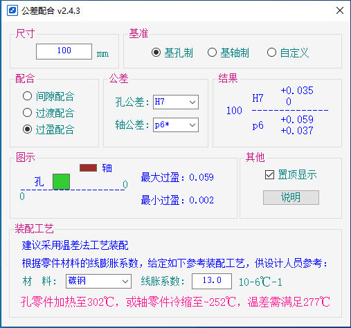

# 公差配合查询

作为码农的我，一切创新和优化相关的工具都是基于懒的事实。

工作中会涉及到机械设计、加工。技术部门在对图纸公差配合选用时，需要手动查询《机械设计手册》相关书籍进行确定公差带的具体数值。

手工查询书籍太麻烦了，且效率低，出错率也比较高。根据这个现状我就写了本项目的一个小工具，便于设计人员、生产人员进行快速查询。

涵盖国家标准中所有公差尺寸。

记录一下可能会对你有所帮助，并且非常欢迎大家贡献它~

## 如何贡献

针对发现的问题，直接修改并提交 Pull request 即可。

## 启动它

## 详细说明

此软件是免费、绿色、小巧、实用的工具软件，符合《GB/T 1800.3-1998》和《GB/T 1801-1999》中公差与配合的规定。

### 特点:

    1. 基本尺寸范围0～10000mm,公差等级范围IT01～IT18共20个等级；
    
    2. 除基本尺寸大于3150～10000mm(没有相应配合标准)之外，均采用标准所列配合。其中基本尺寸至500mm中， '为常用配合，*为优先配合；
    
    3. ”自定义”查询涵盖所有公差，包括IT01、IT0等级的公差和cd、ef、za等特殊公差；" 
    
    4. 图表显示公差带情况和极限间隙或极限过盈数值；
    
    5. 快速显示查询结果，每一项改变都会自动更新结果。

### 声明：

   软件难免有错，作者不承担任何责任，但作者会努力完善软件。

### 信息：

项目地址：https://github.com/zhangsanbin/Tolerance/

下载地址：https://github.com/zhangsanbin/Tolerance/releases

作者：张三宾  邮箱：andy@doipc.com

致敬：黄正堃  kunlunsoft@163.com

致敬：软件UI受到“黄正堃”同志的启发，借鉴了其开发的“公差带查询”界面，此软件新增并完善了诸多功能，供大家免费使用。

### 公差说明：

在孔与轴的配合中，孔的尺寸减去相配合轴的尺寸，其差值为正时为间隙。间隙配合就是孔公差带在轴公差带之上，具有间隙的配合（包括最小间隙为零的配合）。

### 间隙配合时轴的基本偏差选用说明：

(1) a、b：可得到特别大的间隙，应用很少。
    
(2) c：可得到很大的间隙，一般适用于缓慢、松弛的动配合。用于工作条件较差（如农业机械等）、受力变形、或为便于装配而必须保证有较大的间隙时，推荐配合为H11/c11，较高等级的H8/c7配合，适用于轴在高温工作的紧密动配合，如内燃机排气阀和导管等。
    
(3) d：一般用于IT7-IT11级，适用于松的转动配合，如密封盖、滑轮、空转皮带轮等与轴的配合，也适用于大直径滑动轴承配合，如透平机、球磨机、轧辊成型和重型弯曲机以及其它重型机械中的一些滑动轴承。
    
(4) e：多用于IT7、8、9级，通常用于要求有明显间隙，易于转动的轴承配合，如大跨距轴承、多支点轴承等配合，高等级的e轴适用于大的、高速、重载支承，如涡轮发动机、大型电动机及内燃机主要轴承、凸轮轴轴承等配合。
    
(5) f：多用于IT6、7、8级的一般传动配合，当温度影响不大时，被广泛用于普通润滑油（或润滑脂）润滑的支承，如齿轮箱、小电动机、泵等的转轴与滑动轴承的配合。
    
(6) g：配合间隙很小，制造成本高，除很轻负荷的精密装置外，不推荐用于转动配合。多用于IT5、6、7级，最适合不回转的精密滑动配合，也用于插销等定位配合，如精密连杆轴承、活塞及滑阀、连杆销等。
    
(7) h：多用于IT4-IT11级。作为一般的定位配合，广泛用于无相对转动的零件。若没有温度、变形影响，也可用于精密滑动配合。

### 孔公差查询注释：

1. 基本尺寸小于1mm时，各级的A和B均不采用。

2．各级CD、EF、FG主要用于精密机械和钟表制造业。

3．IT14至IT18只用于大于1mm的基本尺寸。

4．J8、J10等公差带对称于零线，其偏差值可见JS9、JS10等。

5．基本尺寸大于3mm时，大于IT8的K的偏差值不作规定。

6．基本尺寸大于3～6mm的J7的偏差值与对应尺寸段的JS7等值。

7．公差带N9、N10和N11只用于大于1mm的基本尺寸。

8．基本尺寸至24mm的T5至T8的偏差值，建议以U5至U8代替。如一定要T5至T8，则可按照GB/T 1800.3计算。

9．基本尺寸至14mm的V5至V8的偏差值，建议以X5至X8代替。如一定要V5至V8，则可按照GB/T 1800.3计算。

10．基本尺寸至18mm的Y6至Y10的偏差值，建议以Z6至Z10代替。如一定要Y6至Y10，则可按照GB/T 1800.3计算。

11．基本尺寸处于1500mm至3150mm之间的IT1至IT5的偏差值为试用值。

### 轴公差查询注释：

1. 基本尺寸小于1mm时，各级的a和b均不采用

2．各级cd、ef、fg主要用于精密机械和钟表制造业。

3．IT14至IT18只用于大于1mm的基本尺寸。

4．基本尺寸至24mm的t5至t8的偏差值，建议以u5至u8代替。如一定要t5

### 至t8，则可按照GB/T 1800.3计算。

5．基本尺寸至14mm的v5至v8的偏差值，建议以x5至x8代替。如一定要v5

### 至v8，则可按照GB/T 1800.3计算。

6．基本尺寸至18mm的y6至y10的偏差值，建议以z6至z10代替。如一定要

### y6至y10，则可按照GB/T 1800.3计算。

7. 基本尺寸处于500mm至3150mm之间的IT1至IT5的偏差值为试用值。
